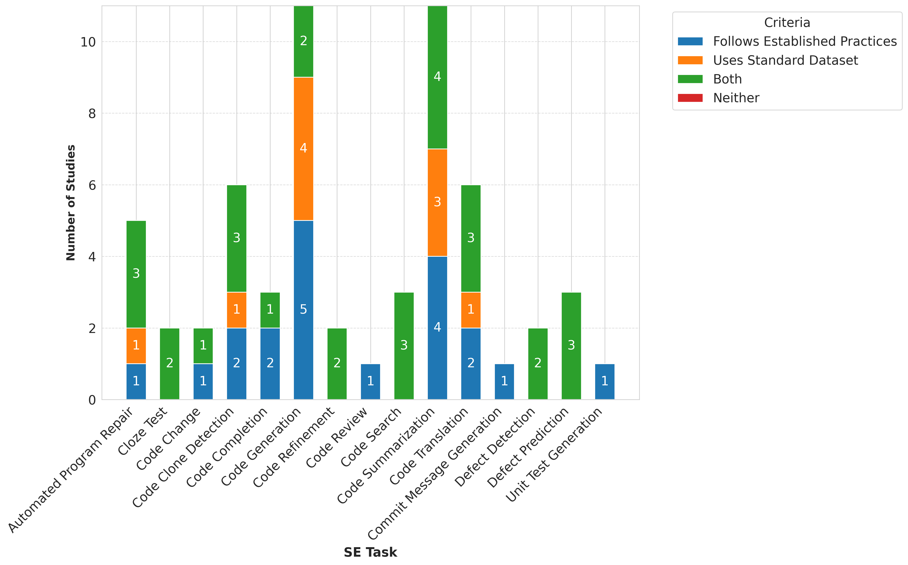
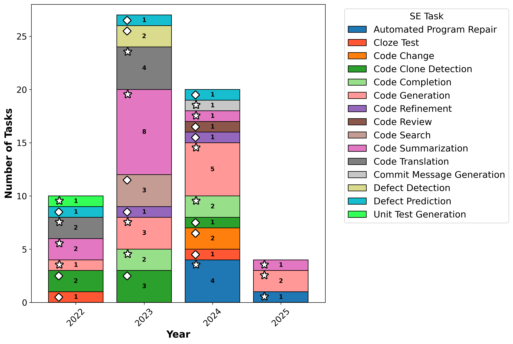
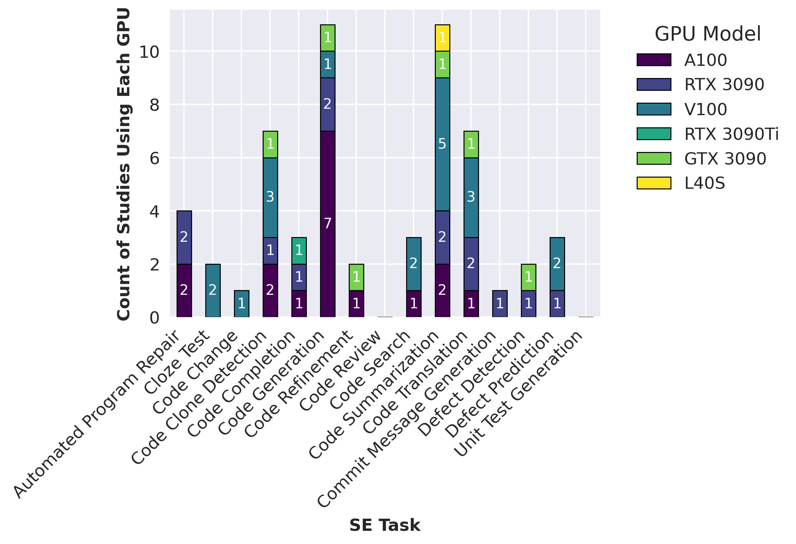
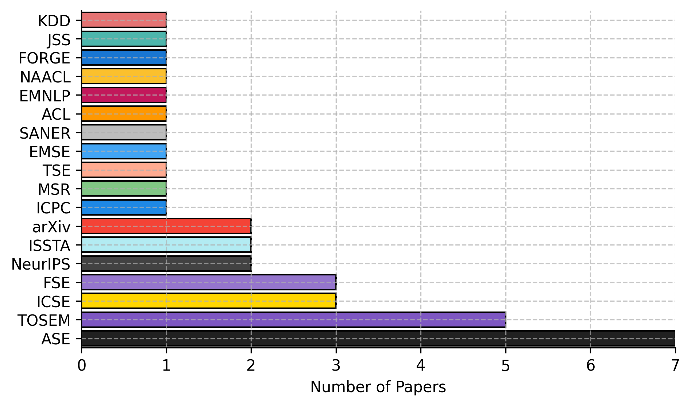
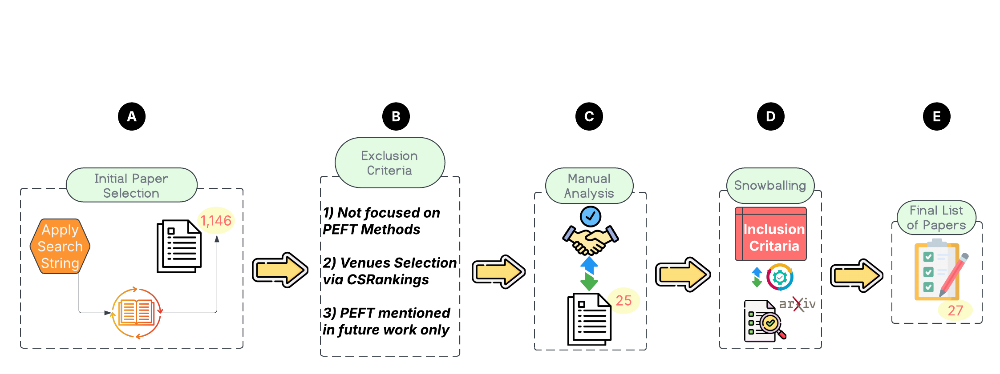

# PEFT-SE-Analysis

This repository contains code, data, and visualizations for analyzing benchmarking practices in Parameter-Efficient Fine-Tuning (PEFT) methods for Software Engineering (SE) tasks.

## Overview

This project analyzes how PEFT methods are evaluated across 15 different Software Engineering tasks, examining:
- Adherence to established evaluation practices
- Usage of standard datasets
- Distribution of PEFT methods across tasks
- Hardware resources used in studies
- Publication venues and trends over time

## Visualizations

### 1. Benchmarking Practices Across SE Tasks

This stacked bar chart illustrates how different SE tasks compare in terms of:
- Studies following established evaluation practices
- Studies using standard datasets
- Studies that follow both practices
- Studies that follow neither practice

The visualization reveals that while many studies follow established evaluation metrics, there's significant room for improvement in adopting standard datasets for fair comparisons.

### 2. SE Task Distribution Over Time

This visualization shows the evolution of PEFT-SE research from 2022 to 2025, highlighting:
- The growing diversity of SE tasks being addressed
- The increasing focus on Code Generation and Code Summarization
- Emerging research in newer areas like Defect Prediction and Code Refinement

### 3. GPU Hardware Distribution

This chart presents the hardware resources used across different SE tasks, showing:
- Predominant use of high-end GPUs (A100, V100) for compute-intensive tasks
- Variation in hardware requirements across different SE applications
- Tasks requiring the most computational resources

### 4. Publication Venues

This visualization shows where PEFT-SE research is being published, with ASE, TOSEM, FSE, and ICSE being the primary venues.

### 5. Paper Selection Process

This flowchart illustrates our systematic approach to paper selection, from initial search to final inclusion.

## Repository Structure
