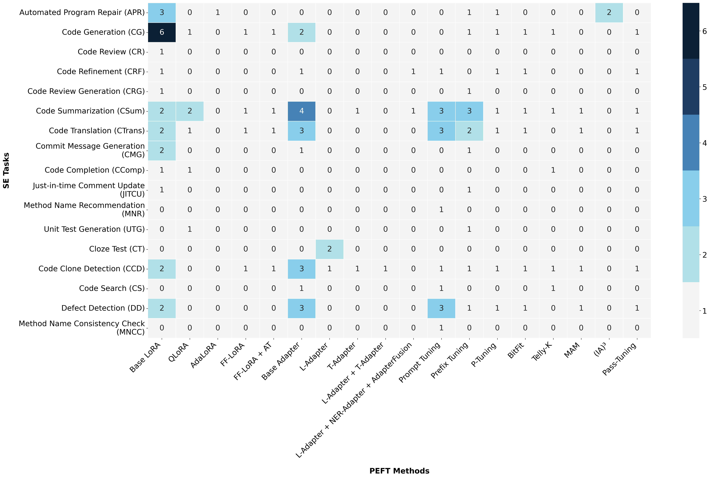
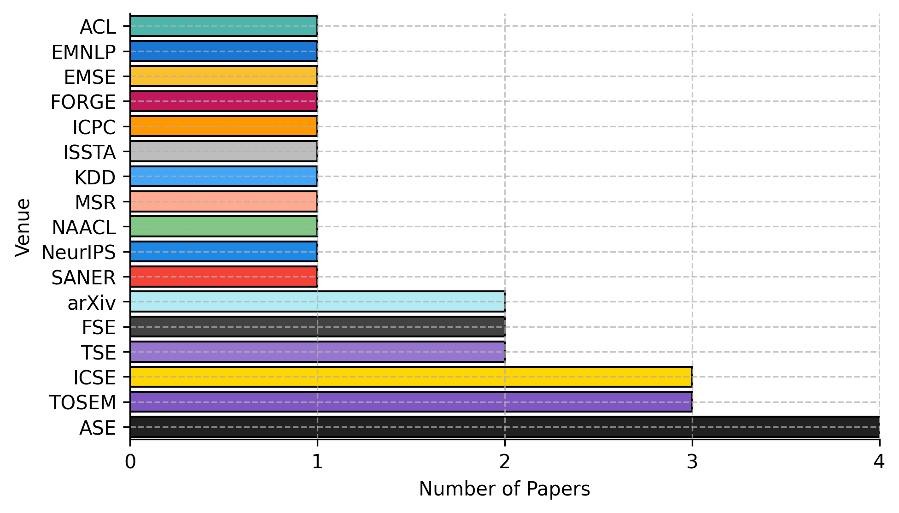

# A Systematic Literature Review of Parameter-Efficient Fine-Tuning for Large Code Models

## Abstract

The rise of Artificial Intelligence (AI)—and particularly Large Language Models (LLMs) for code—has reshaped Software Engineering (SE) by enabling the automation of tasks such as code generation, bug detection, and repair. However, these models require significant computational resources for training and fine-tuning, posing challenges for real-world adoption in resource-constrained environments. To address this, the research community has increasingly turned to Parameter-Efficient Fine-Tuning (PEFT)—a class of techniques that enables the adaptation of large models by updating only a small subset of parameters, rather than the entire model.

In this Systematic Literature Review (SLR), we examine the growing application of PEFT techniques across a wide range of software engineering tasks. We analyze how these methods are used to optimize various deep learning (DL) architectures, focusing on their impact on both performance and efficiency.

Our study synthesizes findings from 27 peer-reviewed papers, identifying patterns in configuration strategies and adaptation trade-offs. The outcome of this review is a comprehensive taxonomy that categorizes PEFT usage by task type, distinguishing between generative (e.g., Code Summarization) and non-generative (e.g., Code Clone Detection) scenarios.

Our findings aim to inform future research and guide the practical deployment of PEFT in sustainable, AI-powered software development.

---

## Overview

This repository analyzes benchmarking practices for Parameter-Efficient Fine-Tuning (PEFT) methods applied to Software Engineering (SE) tasks.

We cover:
- Adherence to established evaluation practices
- Usage of standard datasets
- Distribution of PEFT methods across tasks
- Hardware resources used in studies
- Publication venues and trends over time

---

## Visualizations

### 1. Heatmap of PEFT Methods Across SE Tasks



- **Figure**: Number of studies using each PEFT method for each SE task.

### 2. SE Task Distribution Over Time


- Evolution of SE tasks targeted by PEFT research from 2022–2025.


### 3. Publication Venues



- Distribution of PEFT-SE research across conferences and journals.

### 4. Paper Selection Process


- Systematic workflow for paper selection in the SLR.

---

## Repository Structure

| Folder/File | Purpose |
|:------------|:--------|
| `/data` | Contains processed data and metadata for selected papers |
| `/visualizations` | All generated charts and plots (including the new heatmap) |
| `/code` | Scripts for data processing and visualization |
| `README.md` | Updated README document |
| `LICENSE` | License information |
| `requirements.txt` | Python dependencies (if applicable) |

---

## How to Reproduce

1. Clone the repository:
   ```bash
   git clone <repo-url>
   cd <repo-directory>
   ```
2. Install requirements:
   ```bash
   pip install -r requirements.txt
   ```
3. Run visualization scripts (optional):
   ```bash
   python code/generate_visualizations.py
   ```

Outputs will be saved inside the `/visualizations` folder.

---

Thank you for exploring our work on PEFT for SE tasks!
